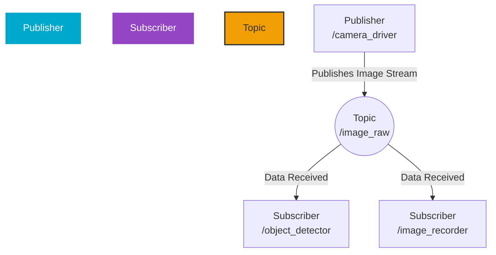
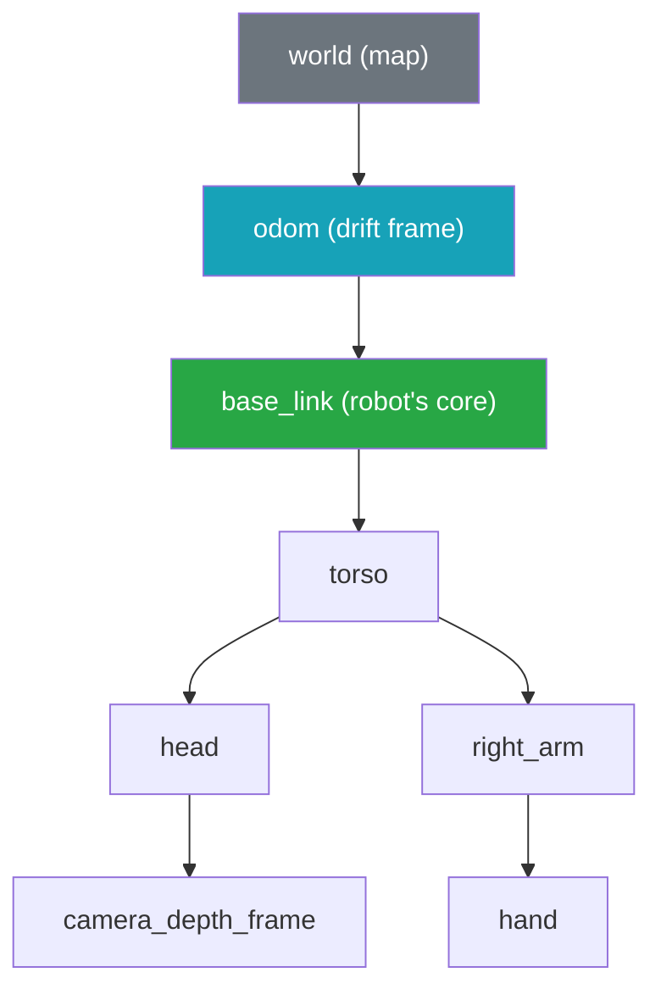

<div style={{padding: '20px', background: 'linear-gradient(90deg, #0f0c29, #302b63, #24243e)', color: 'white', textAlign: 'center', borderRadius: '8px', marginBottom: '20px'}}>
  <h1>Chapter 1: The Robotic Nervous System</h1>
  <p style={{fontSize: '1.2em'}}>Crafting the Digital Backbone with ROS 2</p>
  
</div>

<div style={{backgroundColor: '#1e1e2f', padding: '20px', borderRadius: '8px', color: 'white', marginBottom: '20px'}}>

## 1.1 The Digital Backbone

Every advanced robot is a symphony of systems: sensors, motors, controllers, and AI all working in concert. To prevent this complexity from descending into chaos, we need a master framework. In modern robotics, that framework is the **Robot Operating System (ROS)**.

Think of ROS 2 as the robot's high-speed central nervous system. It's the intricate web of pathways that allows the 'brain' (AI) to command the 'body' (motors) and receive feedback from the 'senses' (sensors), ensuring every component communicates with every other in a structured, reliable, and incredibly fast way.

:::info[A New Era: ROS 1 vs. ROS 2]
This book is built exclusively on ROS 2. It is a ground-up redesign of its predecessor, engineered for the demands of modern robotics: real-time control, multi-robot fleets, and commercial-grade security and reliability. We are building for the future.
:::

</div>

## 1.2 The Trinity of Communication

The ROS 2 architecture is an elegant graph of independent programs, called **Nodes**, that communicate in three primary ways.

<div style={{backgroundColor: '#1A1A2A', padding: '20px', borderRadius: '8px', color: 'white', marginBottom: '20px'}}>

### Topics: The Asynchronous Broadcast 📢
**Topics** are the lifeblood of ROS 2 data streams. A **Publisher** node writes data to a topic, and any number of **Subscriber** nodes can listen. This is asynchronous communication, making the system incredibly decoupled and flexible.



### Services: The Synchronous Handshake 🤝
**Services** are for direct, request-response interactions. A **Client** node sends a request, and a **Server** node processes it and returns a result. This is perfect for tasks that require a direct answer.

```mermaid
graph TD
    style Client fill:#D94A4A,stroke:#fff,stroke-width:2px,color:#fff
    style Server fill:#4AB3D9,stroke:#fff,stroke-width:2px,color:#fff
    style Service fill:#6A44C2,stroke:#fff,stroke-width:2px,color:#fff

    E[Client<br/>/motion_planner] -- Request: "Solve IK for this pose" --> F((Service<br/>/solve_ik));
    G[Server<br/>/ik_solver_node] -- Provides Service --> F;
    F -- Response: "Joint angles are [1.2, 0.5...]" --> E;
```

</div>

<div style={{backgroundColor: '#f0f2f5', padding: '20px', borderRadius: '8px', marginTop: '20px', marginBottom: '20px', display: 'flex', alignItems: 'center', gap: '20px'}}>
  
  <div>
    <h3 style={{marginTop: '0'}}>ROS 2 Computation Graph</h3>
    <p>The ROS 2 graph is a living network where nodes, topics, and services interact to bring a robot to life. Mastering this graph is the first step to becoming a robotics engineer.</p>
  </div>
</div>

## 1.3 The Robot's Digital DNA: URDF

The **Unified Robot Description Format (URDF)** is an XML file that serves as the robot's digital blueprint. It meticulously defines the robot's physical form.

```
            +====================+
            |      torso_link    |
            +====================+
                   |
                   | (shoulder_joint - revolute)
                   |
     +===========================+
     |      upper_arm_link       |
     +===========================+
                   |
                   | (elbow_joint - revolute)
                   |
        +==================+
        |  forearm_link    |
        +==================+
```

```xml title="humanoid_arm_snippet.urdf"
<!-- The robot's upper arm -->
<link name="upper_arm_link">
  <visual>
    <geometry><cylinder length="0.5" radius="0.05"/></geometry>
    <material name="white"><color rgba="1.0 1.0 1.0 1.0"/></material>
  </visual>
  <collision>
      <geometry><cylinder length="0.5" radius="0.05"/></geometry>
  </collision>
  <inertial>
      <mass value="1.5"/>
      <inertia ixx="0.1" iyy="0.1" izz="0.01" ixy="0" ixz="0" iyz="0"/>
  </inertial>
</link>

<!-- The joint connecting shoulder to upper arm -->
<joint name="shoulder_joint" type="revolute">
  <parent link="shoulder_link"/>
  <child link="upper_arm_link"/>
  <origin xyz="0 0 -0.25" rpy="0 0 0"/>
  <axis xyz="0 1 0"/>
  <limit lower="-1.57" upper="1.57" effort="10" velocity="1.0"/>
</joint>
```

## 1.4 State, Control, and Orchestration

A **TF (Transform) Tree** is a live, dynamic map of all coordinate frames within the system. It answers the critical question: "Where is the hand relative to the head?"



<div style={{display: 'grid', gridTemplateColumns: 'repeat(auto-fit, minmax(250px, 1fr))', gap: '15px', marginTop: '20px', marginBottom: '20px'}}>
  <div style={{textAlign: 'center'}}>
    
    <p style={{fontStyle: 'italic'}}>TF Tree Visualization in RViz</p>
  </div>
  <div style={{textAlign: 'center'}}>
    
    <p style={{fontStyle: 'italic'}}>Orchestrating Nodes with Launch Files</p>
  </div>
  <div style={{textAlign: 'center'}}>
    
    <p style={{fontStyle: 'italic'}}>Complex Joint Kinematics</p>
  </div>
</div>

---

<div style={{backgroundColor: '#101114', padding: '20px', borderRadius: '8px', color: 'white', marginBottom: '20px'}}>

### Chapter 1 Debrief & Practice Lab

**Conceptual Debrief:**
You have now laid the digital nervous system for our sentient machine. You understand how isolated nodes can form a complex, communicative network and how the robot's physical and spatial identity is defined and broadcasted. This is the bedrock upon which all higher intelligence will be built.

**Practice Lab:**
1.  **Node Creation:** Write a Python ROS 2 node called `status_publisher` that publishes a custom string message to a `/robot_status` topic every 2 seconds. The message should be "System Nominal".
2.  **Service Definition:** Create a service that takes a string request (e.g., "calculate_ik") and returns a boolean `success` field and a string `message` field. For now, the server can just return `success: true` and `message: "IK solution found"`.
3.  **URDF Design:** Write a basic URDF for a simple lamp, with a `base_link`, a `stand_link`, and a `bulb_link`. Connect them with `fixed` joints.
4.  **Launch It All:** Create a single launch file that starts your `status_publisher` node and your service server node.

</div>