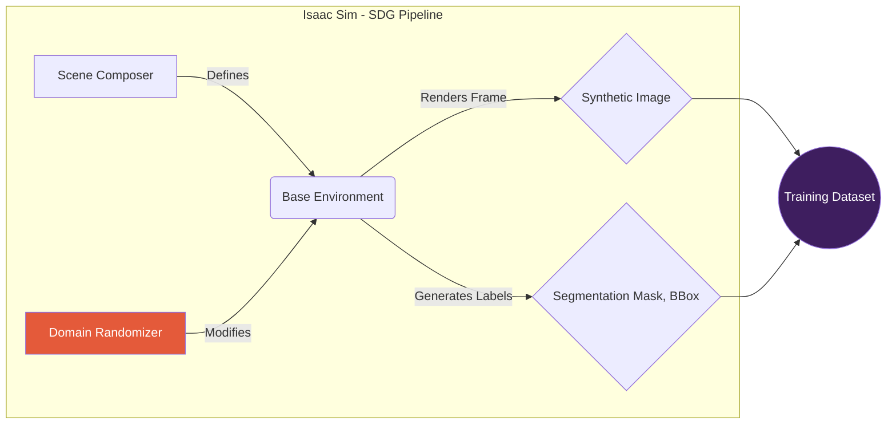

<div style={{padding: '20px', background: 'linear-gradient(90deg, #3E1E5F, #8E3A6D, #E45A3A)', color: 'white', textAlign: 'center', borderRadius: '8px', marginBottom: '20px'}}>
  <h1>Chapter 3: The AI-Robot Brain</h1>
  <p style={{fontSize: '1.2em'}}>Unleashing Perception with NVIDIA Isaac</p>
  
</div>

<div style={{backgroundColor: '#1e1e2f', padding: '20px', borderRadius: '8px', color: 'white', marginBottom: '20px'}}>

## 3.1 The Dawn of Accelerated AI

Our robot has a body and a world. It's time to give it a mind. A modern robotic brain isn't just code; it's a torrent of data processed by specialized AI models running on powerful, dedicated hardware. This is the domain of **NVIDIA Isaac**, a revolutionary platform designed to build and deploy GPU-accelerated AI for robotics.

The Isaac ecosystem provides two key pillars for our project:
- **Isaac Sim:** An industrial-grade simulator built on NVIDIA Omniverse for generating photorealistic, physically-accurate training data.
- **Isaac ROS:** A suite of supercharged ROS 2 packages that leverage the GPU to perform complex AI tasks at blistering speeds.

Welcome to the world of real-time robotic perception.

</div>

## 3.2 Isaac Sim: The Synthetic Data Factory

To learn to recognize a "soda can," an AI model needs to see thousands of examples under different lighting, angles, and backgrounds. Collecting this data in the real world is a monumental bottleneck. **Isaac Sim** shatters this bottleneck by acting as a "reality generator."



<div style={{backgroundColor: '#f0f2f5', padding: '20px', borderRadius: '8px', marginTop: '20px', marginBottom: '20px', display: 'flex', alignItems: 'center', gap: '20px'}}>
  
  <div>
    <h3 style={{marginTop: '0'}}>Domain Randomization</h3>
    <p>By randomizing textures, lighting, and camera angles, Isaac Sim forces the AI to learn an object's true features, making it robust enough for the unpredictable real world.</p>
  </div>
</div>

## 3.3 Isaac ROS: Unleashing the GPU 🚀

Standard ROS 2 nodes run on the CPU. For the intense, parallel computations required by modern AI, CPUs are simply too slow. **Isaac ROS** provides "GEMs"—hardware-accelerated packages that offload the heavy lifting to the GPU.

```mermaid
graph TD
    subgraph "Traditional CPU Bottleneck"
        A[Camera Data] --> B{CPU-based<br>Perception Node};
        B --> C[Processed Data];
        D[CPU] -- Overloaded --> B;
    end
    subgraph "Isaac ROS Accelerated Workflow"
        E[Camera Data] --> F{Isaac ROS Node};
        F -- Offloads work to --> G[GPU<br>(TensorRT, CUDA)];
        G -- Returns result --> F;
        F --> H[Real-time<br>Processed Data];
    end

    style B fill:#D94A4A, color:#fff
    style G fill:#28a745, color:#fff
```

This offloading is critical: it frees up the CPU to focus on what it does best—running the control loops, motion planning, and high-level logic that keep the robot stable and responsive.

<div style={{display: 'grid', gridTemplateColumns: 'repeat(auto-fit, minmax(250px, 1fr))', gap: '15px', marginTop: '20px', marginBottom: '20px'}}>
  <div style={{textAlign: 'center'}}>
    
    <p style={{fontStyle: 'italic'}}>GPU-Accelerated AprilTag Detection</p>
  </div>
  <div style={{textAlign: 'center'}}>
    
    <p style={{fontStyle: 'italic'}}>GPU-Accelerated Visual SLAM</p>
  </div>
  <div style={{textAlign: 'center'}}>
    
    <p style={{fontStyle: 'italic'}}>GPU-Accelerated Object Detection</p>
  </div>
</div>

## 3.4 VSLAM & Nav2: Where Am I? Where Am I Going?

**Visual-Inertial SLAM (VSLAM)** is how the robot builds a map of its world while simultaneously tracking its position within it. The `isaac_ros_visual_slam` package is a state-of-the-art, GPU-accelerated implementation.

With a map and a location, the robot can now plan its path using the **Navigation2 (Nav2)** stack.

:::danger[Humanoids Are Not Wheeled Robots!]
Nav2 was designed for robots that can turn on a dime. Applying it to a bipedal humanoid requires special considerations, especially creating a custom **local planner** that thinks in terms of footsteps rather than wheel velocities.
:::

A costmap is a 2D grid that represents the "cost" of traversing different areas. Obstacles have a high cost (dark), and open space has a low cost (light).

```
COSTMAP REPRESENTATION

. . . . . . . . . . . . . . . . . . .
. . . . . . . . . . . . . . . . . . .
. . . . . . # # # . . . . . . . . . .
. . . . . . # # # . . . . . . . . . .
. . . R . . # # # . . . . . . . G . .
. . . . . . . . . . . . . . . . . . .
. . . . . . . . . . . . . . . . . . .
. . . . . . . . . . . . . . . . . . .

R = Robot Position
G = Goal Position
# = High-cost obstacle
. = Low-cost open space
```

```mermaid
graph LR
    A[VSLAM] -- "I am at (X, Y)" --> B{Nav2 Stack};
    C[Goal] -- "Go to (X', Y')" --> B;
    B -- "Global Plan" --> D[Global Planner];
    D -- Path --> E[Local Planner<br/>(Footstep Planner)];
    E -- "Next Footstep" --> F[Robot Controller];
    G[Sensor Data] -- "New Obstacles" --> H[Costmap];
    H --> E;
```

---

<div style={{backgroundColor: '#101114', padding: '20px', borderRadius: '8px', color: 'white', marginBottom: '20px'}}>

### Chapter 3 Debrief & AI Training Mission

**Conceptual Debrief:**
You have forged the robot's brain, a powerful AI engine capable of real-time perception and navigation. You now understand how to leverage the NVIDIA Isaac ecosystem to break the performance barriers of traditional robotics, offloading the intense work of perception to the GPU.

**AI Training Mission:**
1.  **Synthetic Data Generation:** In Isaac Sim, create a simple scene with a flat plane and a single object (e.g., a cube). Write a Python script to randomize the cube's position and the color of the light in the scene. Have it save 100 images and their corresponding bounding box labels.
2.  **VSLAM Analysis:** Using the `isaac_ros_visual_slam` package, manually drive your robot around the Gazebo world from Chapter 2. In RViz, visualize the generated point cloud map and the `/tf` transform it publishes. Observe how it corrects for drift when you return to a previously visited location.
3.  **Nav2 Goal Setting:** Launch the full Nav2 stack. In RViz, use the "2D Goal Pose" tool to set a navigation goal for your robot. Watch as the global and local planners generate paths and the robot attempts to follow them. Experiment with placing obstacles in the robot's path and see how it reacts.

</div>