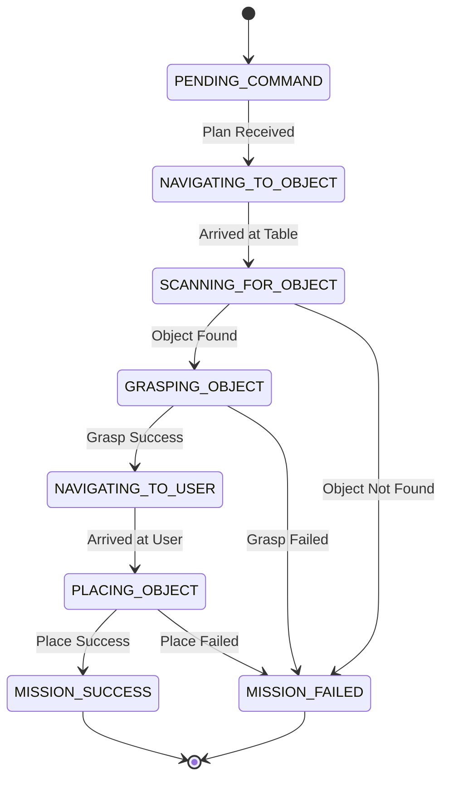

<div style={{padding: '20px', background: 'linear-gradient(90deg, #093028, #237A57)', color: 'white', textAlign: 'center', borderRadius: '8px', marginBottom: '20px'}}>
  <h1>Chapter 4: From Language to Legacy</h1>
  <p style={{fontSize: '1.2em'}}>The VLA Architecture and Final Capstone</p>
  
</div>

<div style={{backgroundColor: '#1e1e2f', padding: '20px', borderRadius: '8px', color: 'white', marginBottom: '20px'}}>

## 4.1 The Cognitive Leap

We have arrived at the final frontier. Our robot has a nervous system, a body, and a brain that can perceive and navigate. But how do we communicate our *intent* to it? This is the purpose of a **Vision-Language-Action (VLA)** architecture. It forges the ultimate link between a human's high-level command and a robot's physical action, creating a cognitive engine that can listen, see, reason, and act.

This final chapter details the construction of this cognitive core and culminates in the capstone project where we put it all to the test.

</div>

## 4.2 The VLA Pipeline

The VLA architecture is a pipeline that transforms human speech into robotic motion.

```mermaid
graph TD
    style UserInput fill:#237A57, color:#fff
    style LLM fill:#6f42c1, color:#fff
    style Executor fill:#dc3545, color:#fff
    
    A[UserInput: Voice Command] --> B{Whisper Node<br/>(Speech-to-Text)};
    B -- "get me the soda" --> C{LLM Planner Node};
    C -- "How do I do that?" --> D[LLM Core (GPT-4)];
    E[Robot's Abilities<br/>(Function Menu)] -->|System Prompt| D;
    D -- "Here is your step-by-step plan" --> C;
    C -- Publishes Plan --> F((Task Plan));
    F --> G[Executor Node];
    G -- Dispatches goals to --> H[ROS 2 Ecosystem<br/>(Nav2, MoveIt)];

```

<div style={{backgroundColor: '#f0f2f5', padding: '20px', borderRadius: '8px', marginTop: '20px', marginBottom: '20px', display: 'flex', alignItems: 'center', gap: '20px'}}>
  
  <div>
    <h3 style={{marginTop: '0'}}>Cognitive Architecture</h3>
    <p>A VLA model fuses multiple modalities—vision, language, and action—into a single, powerful reasoning engine, allowing it to understand and execute complex, multi-step tasks.</p>
  </div>
</div>

<div style={{backgroundColor: '#1A1A2A', padding: '20px', borderRadius: '8px', color: 'white', marginBottom: '20px'}}>

### The System Prompt: The LLM's Constitution

The **System Prompt** is our contract with the LLM, defining its role and its available tools. This is the key to controlling its output for robotics.

> **System Prompt Example:**
> You are the master controller for a humanoid robot. Your goal is to translate user commands into a precise sequence of actions. You must only use the functions provided to you. The world contains these known locations: `['kitchen_counter', 'living_room_table', 'charging_dock']`.
>
> **Available Functions:**
> - `goTo(location: string)`: Navigate to a known location.
> - `findObject(object_description: string)`: Scan the area for an object.
> - `pickUp(object_id: int)`: Execute a grasp on a specific object ID.
> - `place(location: string)`: Place the held object at the specified location.

</div>

## 4.3 Capstone Mission: "Get Me the Soda"

This is the final test, combining every module from the book.

**The Scene:**
```
+--------------------------------+--------------------------------+
|         LIVING ROOM            |             KITCHEN            |
|                                |                                |
|        (User Position)         |        +---------------+       |
|              U                 |        |     Table     |       |
|                                |        |    [G] [R] [B]|       |
|                                |        +---------------+       |
|                                |                                |
|             (Robot Start)      |                                |
|                R               |                                |
+--------------------------------+--------------------------------+
U = User, R = Robot, G = Green Can, R = Red Box, B = Blue Sphere
```

<div style={{display: 'grid', gridTemplateColumns: 'repeat(auto-fit, minmax(250px, 1fr))', gap: '15px', marginTop: '20px', marginBottom: '20px'}}>
  <div style={{textAlign: 'center'}}>
    
    <p style={{fontStyle: 'italic'}}>Step 1: Visual Identification</p>
  </div>
  <div style={{textAlign: 'center'}}>
    
    <p style={{fontStyle: 'italic'}}>Step 2: Autonomous Navigation</p>
  </div>
  <div style={{textAlign: 'center'}}>
    
    <p style={{fontStyle: 'italic'}}>Step 3: Precise Manipulation</p>
  </div>
</div>

### The Task Executor State Machine

The `task_executor_node` runs a state machine to manage the mission.



---

<div style={{backgroundColor: '#101114', padding: '20px', borderRadius: '8px', color: 'white', marginBottom: '20px'}}>

### Chapter 4 Debrief & Your Final Mission

**Conceptual Debrief:**
You have done it. You have built a complete cognitive architecture, bridging the gap from abstract human language to precise physical action. You understand how to use LLMs as reasoning engines, how to control their output with function calling, and how to orchestrate the entire ROS 2 ecosystem to execute a complex, multi-step plan.

**Your Final Mission:**
1.  **Full System Launch:** Write and execute the final `capstone.launch.py` file that brings every node from this book online.
2.  **Voice Command Execution:** Speak the command: "Hey robot, could you please get me the green soda from the kitchen table?".
3.  **Observe and Debug:** Watch the entire process unfold. Use RViz and your terminal logs to monitor the state of the system at every step of the Task Executor's state machine. If a step fails, use your knowledge to debug it. Does Nav2 have the correct goal? Is the perception node identifying the object correctly? Is MoveIt 2 able to find a valid IK solution?
4.  **Success!** Witnessing your robot successfully complete the mission from start to finish is the ultimate reward.
5.  **Bonus Mission:** Modify the system to handle a follow-up command. After the robot places the can, say "Thank you. Now please go to your charging dock." The robot should navigate to its dock. This requires adding a new known location and ensuring the VLA pipeline can handle conversational context.

The future is not something we wait for. It is something we build. **Now, go build it.**

</div>